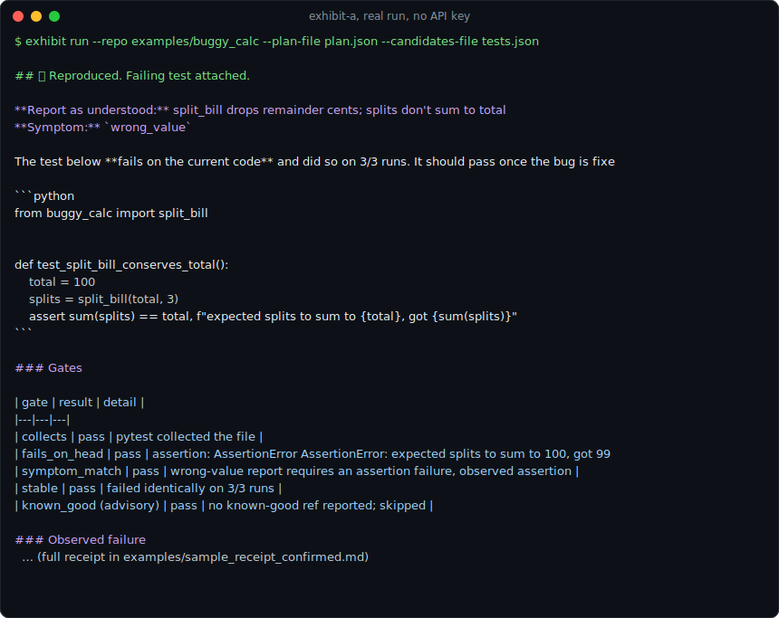

# exhibit-a 🔍

**Every bug report gets a failing test attached, or a receipt showing why it couldn't be reproduced.**

You point exhibit-a at a repo and a bug report. It reads the report, writes a test that should fail because of the bug, runs it in a locked-down sandbox, and hands back one of two things:

- **✅ CONFIRMED.** Here is a test that fails on your current code and asserts the behavior the reporter expected. Drop it in, fix the bug, watch it go green.
- **❌ UNREPRODUCIBLE.** Here is every test I tried, which gate each one died at, and the exact questions the reporter needs to answer.

No "the AI thinks this is probably a real bug." A verdict you can check, with the receipts to check it.



> The image above is real captured output from `exhibit run` on the bundled example. It is not a mockup. Replay the full session with [`asciinema play demo/demo.cast`](demo/demo.cast).

## The problem, with a real example

Maintainers are drowning. In March 2026 GitHub was seeing [about 17 million AI-generated PRs a month](https://thenewstack.io/ai-generated-code-crisis/), and roughly [1 in 10 was legitimate](https://github.com/orgs/community/discussions/185387). The [Jazzband collective shut down](https://thenewstack.io/ai-generated-code-crisis/) over the flood. curl [killed its bug bounty](https://www.bleepingcomputer.com/news/security/curl-ending-bug-bounty-program-after-flood-of-ai-slop-reports/), brought it back when the slop turned into valid reports, and then took [July 2026 off entirely](https://byteiota.com/curl-takes-july-off-after-ai-slop-killed-its-bug-bounty/) because seven humans cannot triage that volume by hand.

Here is the thing most tools miss: the expensive part is not detecting garbage, it is reproducing what might be real. A report says:

> `split_bill(100, 3)` returns `[33, 33, 33]`, which only sums to 99. A cent vanished.

To know if that is real, a maintainer has to read it, set up the repo, write a little script, run it, and decide if the failure matches. Five minutes if you are lucky, per report, forever. exhibit-a does exactly that loop and comes back with a test:

```python
from buggy_calc import split_bill

def test_split_bill_conserves_total():
    total = 100
    splits = split_bill(total, 3)
    assert sum(splits) == total, f"expected splits to sum to {total}, got {sum(splits)}"
```

...that it has already confirmed fails **3 out of 3 runs** with `AssertionError: assert 99 == 100`, matching the reported "wrong value" symptom. That test is the triage.

## Why existing tools don't solve this

This is not a new idea and I am not going to pretend it is. [LIBRO](https://github.com/coinse/libro) (ICSE 2023), [Issue2Test](https://arxiv.org/abs/2503.16320), and [AssertFlip](https://arxiv.org/html/2507.17542) all showed LLMs can generate reproducing tests. What is missing is a version you can actually install:

| What's out there | What it does | Why it's not this |
|---|---|---|
| **anti-slop / PRAS / Good Egg** | score PR metadata (branch names, size, history) | filters garbage by signal, never runs anything to confirm what is real |
| **[Metabase's Repro-Bot](https://www.metabase.com/blog/reprobot-github-issue-triage-agent)** | reproduces bugs, writes failing tests | hardwired to Metabase (Playwright plus a live REPL into their product); "fork and adapt" |
| **[Cline's triage Action](https://adnanthekhan.com/posts/clinejection/)** | Claude reads issues, reproduces, labels | ran with broad privileges, then [got supply-chain-compromised via an issue title](https://labs.cloudsecurityalliance.org/research/csa-research-note-clinejection-prompt-injection-cicd-cache-p/) |
| **LIBRO / Issue2Test / AssertFlip** | the actual mechanism, proven | research replication packages, nothing on a marketplace |
| **CodeRabbit, Bugbot, etc.** | review diffs | there is no diff yet; a bug report is not a PR |

exhibit-a is the boring missing piece: **general** (config-driven, any pytest repo), **installable** (a CLI and a GitHub Action, not a fork), and **safe to run on a public repo** (the whole next section).

## How it works

Five stages. The LLM touches exactly two of them. Everything that decides CONFIRMED vs UNREPRODUCIBLE is deterministic code you can read in an afternoon.

```
  bug report (untrusted text)
        |
   1. EXTRACT    LLM: turn prose into a typed ReproPlan (JSON schema, forced tool call)
        |           the report is DATA here, never instructions
   2. STAGE      deterministic: copy repo to a throwaway workspace, build a venv,
        |           run the OWNER's setup commands (never anything from the issue)
   3. SYNTHESIZE LLM: draft N candidate failing tests from the plan plus a source slice
        |
   4. VALIDATE   deterministic: the gate gauntlet (below). the heart of the tool.
        |
   5. VERDICT    deterministic: CONFIRMED / UNREPRODUCIBLE / NEEDS_INFO / ENV_FAILED
                    plus a receipt with every gate result
```

**The gate gauntlet.** A candidate test earns CONFIRMED only if it passes all of these:

1. **collects.** pytest can even load the file (no syntax or import junk).
2. **fails_on_head.** It actually fails on the current code. A "repro" that passes is just a unit test with delusions of grandeur.
3. **symptom_match.** It fails for the reported reason. A `UnicodeEncodeError` report is **not** confirmed by a test that dies on a missing import. This is the gate that separates "reproduced the bug" from "wrote a broken test," and it is why exhibit-a parses pytest's junit XML (stable, machine-readable) instead of scraping console text.
4. **stable.** It fails the same way on every rerun (default 3). Flaky repros are exactly how maintainers learn to ignore bots.
5. **known_good** (advisory). If the reporter named a version where it worked, the test should pass there. True fail-then-pass regression evidence.

Because the decision logic is code, not vibes, the receipt shows you every gate and its reasoning. Don't trust the verdict, read the receipts.

### This is not a GPT wrapper

The model is used for the one thing code is bad at: reading a human's messy prose and pulling out the structured claim underneath (stage 1), and drafting test code (stage 3). Then it is escorted out of the building. Whether a test actually reproduces the bug is decided by running it and parsing the result, which is plain, deterministic, and offline. You can run the entire validation engine with a hand-written plan and never make an API call. That is what `exhibit selfcheck` does.

## Threat model (why you can put this on a public repo)

Bug reports are written by strangers, and some strangers would love for your triage bot to run their instructions. In December 2025 a triage agent that read issue text **and** held broad CI privileges got its releases compromised through a crafted issue title ([Clinejection](https://adnanthekhan.com/posts/clinejection/)). exhibit-a is built to make that boring:

- **Issue text is data, never instructions.** It is fenced and labelled untrusted in the prompt, and every LLM call is a forced tool call against a JSON schema, so the model fills a form and cannot "comply" with smuggled commands. The output is re-validated by our own parsers before anything downstream sees it (an `exception_type` of `"rm -rf /"` fails the "looks like a class name" check and gets rejected).
- **The reproduction job holds no keys to the kingdom.** In the GitHub Action, the job that runs the agent and the generated tests has `permissions: {}`, so no `GITHUB_TOKEN` write access to anything. A separate job with only `issues: write` posts the receipt, runs no model, and executes no repo code. Privilege and exposure never share a room.
- **Generated tests run sandboxed.** Throwaway workspace copy (your real checkout is never touched, and `.git` is not even copied). In Docker mode, `--network none` during test execution and no host environment passed through, so a maliciously steered test has no secrets to read and nowhere to send them.
- **No shell, ever.** Every command is an argv list from your `.exhibit.toml`. Nothing from a bug report is ever interpolated into a command line.
- **Receipts can't be weaponized.** Attacker-influenced text (a test's output can echo issue content) is rendered inside code fences with backticks stripped, so it cannot break out of the fence or fire an `@everyone` ping.

Is it unbreakable? No, see Limitations. But it closes the specific holes that have actually bitten people, and it does it by refusing to build the dangerous plumbing rather than by bolting on filters.

## Quickstart

Requires Python 3.11+. The validation engine has **zero runtime dependencies**. The LLM stages need `anthropic`.

```bash
pip install exhibit-a-bot          # the tool
# or with the model stages:
pip install "exhibit-a-bot[llm]"
```

**1. Prove it works on your machine, no API key needed:**

```bash
exhibit selfcheck
```

This runs the whole engine against a bundled buggy package and should print **CONFIRMED** in about 20 seconds. If it does, staging, sandboxing, and the gate engine all work on your box.

**2. Try it on the example, offline** (uses a pre-written plan and test, so still no key):

```bash
exhibit run --repo examples/buggy_calc \
  --plan-file examples/sample_plan.json \
  --candidates-file examples/sample_candidates.json
```

**3. The real thing, a raw bug report plus the model:**

```bash
export ANTHROPIC_API_KEY=sk-...
exhibit init --repo /path/to/your/repo        # writes a starter .exhibit.toml
exhibit run --repo /path/to/your/repo --issue-file bug.md --llm
```

`.exhibit.toml` is how you tell exhibit-a to build and test your project (argv lists, never shell strings):

```toml
[exhibit]
framework = "pytest"
test_dir = "tests"
setup = [["python", "-m", "pip", "install", "-e", ".[test]"]]
test_command = ["python", "-m", "pytest", "{test_file}", "-q"]
timeout_seconds = 300
runs = 3
# docker_image = "python:3.12-slim"   # uncomment for the container sandbox
```

**4. As a GitHub Action.** Label an issue `repro` (or comment `/repro` as a maintainer) and it posts a receipt. See [`.github/workflows/exhibit-repro.yml`](.github/workflows/exhibit-repro.yml) for the two-job security split. You will need `ANTHROPIC_API_KEY` in repo secrets.

Exit codes (so CI can branch): `0` confirmed, `10` unreproducible, `11` needs-info, `12` env-failed.

## Limitations (what this does not do yet)

Being honest here, because a tool that oversells its reach is how you lose the dev crowd:

- **pytest and Python only** in v1. The architecture is framework-agnostic (it shells out and parses junit XML), and vitest is the intended next step, but it is not here yet. If your repo is not pytest, exhibit-a will tell you so and stop.
- **It needs to be able to build your repo.** If `setup` fails, you get an honest `ENV_FAILED`. The bot refuses to blame a reporter for your broken build, but it also cannot reproduce anything. Repos with heavy or exotic setup are where this struggles most. Declaring a devcontainer or a clean `.exhibit.toml` is the fix.
- **GUI, browser, and timing bugs are out of scope.** If reproducing it needs a real display or a race across processes, this is not your tool.
- **It is not a security sandbox for actively malicious code under test.** The threat model covers hostile issue text. If the repository itself is untrusted, run it in Docker mode on a disposable machine, not on your laptop in local mode (which the CLI warns about).
- **UNREPRODUCIBLE does not mean "not a bug."** It means these generated tests did not reproduce it. The receipt says exactly where they gave up so a human can take the last step. Honest, not omniscient.
- **Cost.** LLM mode makes a handful of model calls per issue (roughly 0.15 to 0.60 USD with a Sonnet-class model, bring your own key). The validation engine itself is free and offline.
- **It is a timing play and I will say so.** GitHub is [openly building toward native triage tooling](https://github.github.com/gh-aw/blog/2026-01-13-meet-the-workflows/). This exists because the open, installable, security-first version does not yet. If the platform ships one, use whichever is better, but the receipts-first, no-shell, split-privilege design is worth keeping either way.

## Development

```bash
git clone https://github.com/Dhxnx-git/exhibit-a
cd exhibit-a
pip install -e ".[dev,llm]"
pytest                 # about 66 tests; the e2e ones build real venvs, so give it ~2 min
exhibit selfcheck      # the fastest end-to-end smoke test
```

The interesting code, if you are reading to learn:

- [`exhibit_a/validate.py`](exhibit_a/validate.py): the gate gauntlet plus the junit parser that makes symptom-matching real.
- [`exhibit_a/verdict.py`](exhibit_a/verdict.py): verdict logic plus receipt rendering (and the anti-weaponization bits).
- [`exhibit_a/schemas.py`](exhibit_a/schemas.py): the typed contracts that keep a chatty model in its lane.

Every non-obvious block has a comment explaining why it exists, because this repo is meant to be read, not just run.

## License

MIT, see [LICENSE](LICENSE). Built by Dhanush Musunuru. Named exhibit-a because a confirmed bug report should come with evidence. 🧾
